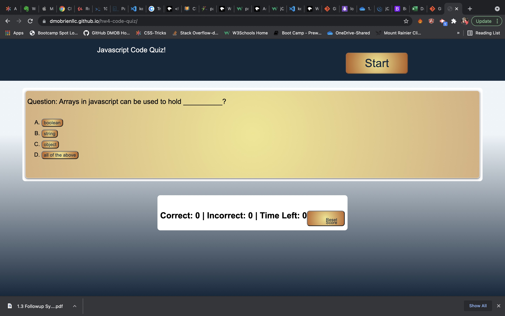

# hw4-code-quiz

## Table of Contents
1. [General Info](#general-info)
2. [Screenshot](#screenshot)
3. [Technologies](#technologies)
4. [Installation](#installation)
5. [FAQs](#faqs)
### General Info
***
### David OBrien's Code quiz

Web based code-quiz application allows user to play game presenting multiple choice Javscript
questions to answer. Game allows players to save initials and track game history.

NOTE: Site still does not support game save at this time. 

### Screenshot

## Technologies
***
A list of technologies used within the project:
  * HTML
  * CSS
  * Javascript

## Installation
***

Link to github repository- https://github.com/dmobrienllc/hw4-code-quiz

Link to live site- https://dmobrienllc.github.io/hw4-code-quiz/

## FAQs
***

Q Is this application awesome?

A Why yes it is!
---

